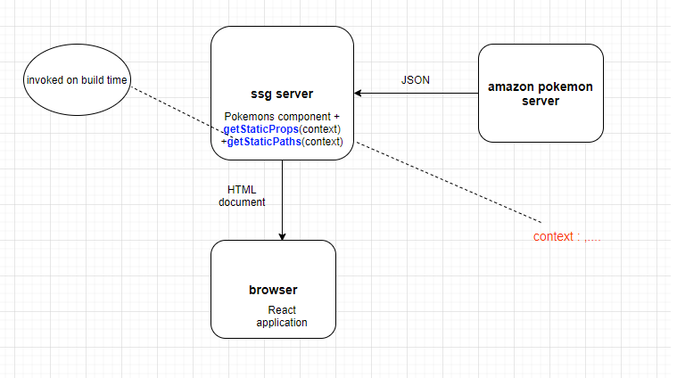

<h2>Motivation</h2>
Play with static site generation (ssg). following <a href='https://www.youtube.com/watch?v=kdXKz1UWc3E'>this : starting 17:45<a>


<h2>Top level schema</h2>




<h2>Creating the project</h2>
i just copy all the files from <a href='https://github.com/NathanKr/next.js-pokemon-ssr'>next.js-pokemon-ssr</a>


<h2>changes compare to ssr</h2>

<h3>Pokemons component</h3>
<p>simple change from getServerSideProps to getStaticProps , thats it !!!!!!</p>
<p>However, now getStaticProps is invoked on the site build time where getServerSideProps is invoked on every request</p>

<h3>pokemonDetails component</h3>
<p>change from getServerSideProps to getStaticProps , but this is not enough because you get an error :</p>
<p>Error: getStaticPaths is required for dynamic SSG pages and is missing for '/pokemons/[pokemonId]'.
Read more: https://nextjs.org/docs/messages/invalid-getstaticpaths-value</p>

<h4>getStaticPaths</h4>
because next.js create all pages on build time he need to know all possible dynamic route and we tell him this in getStaticPaths as follows

```ts

async function getParams(): Promise<IPath[]> {
  const response = await fetch(URL_POKEMONS_JSON);
  const pokemons: IPokemon[] = await response.json();

  return pokemons.map((it) => {
    return { params: { pokemonId: `${it.id}` } };
  });
}

export const getStaticPaths: GetStaticPaths = async (context) => {
  return {
    paths: await getParams(),
    fallback: false, // false or 'blocking'
  };
};

```